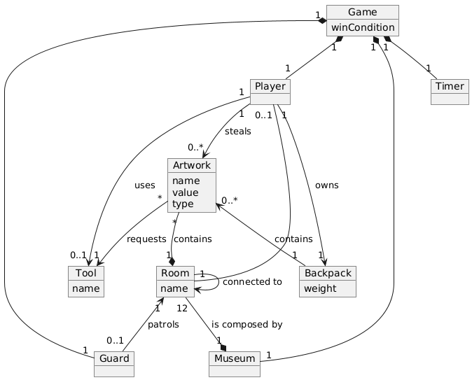
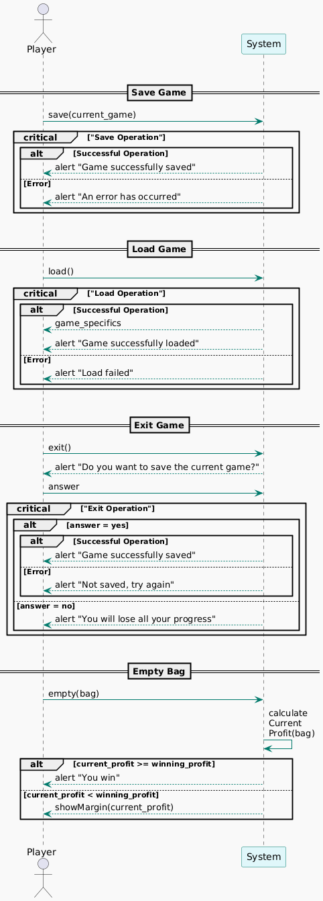
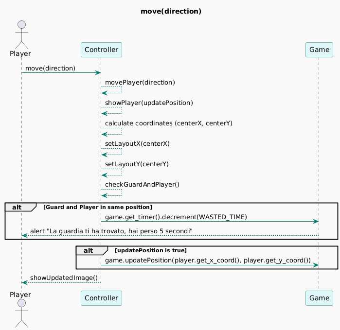
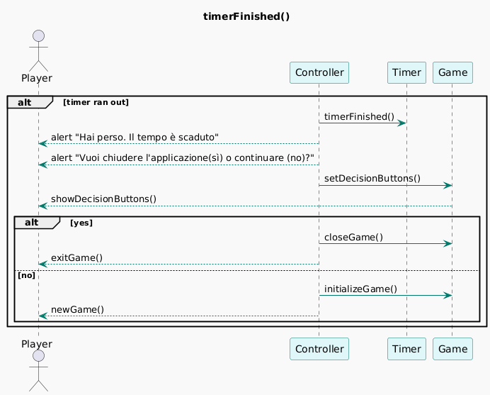
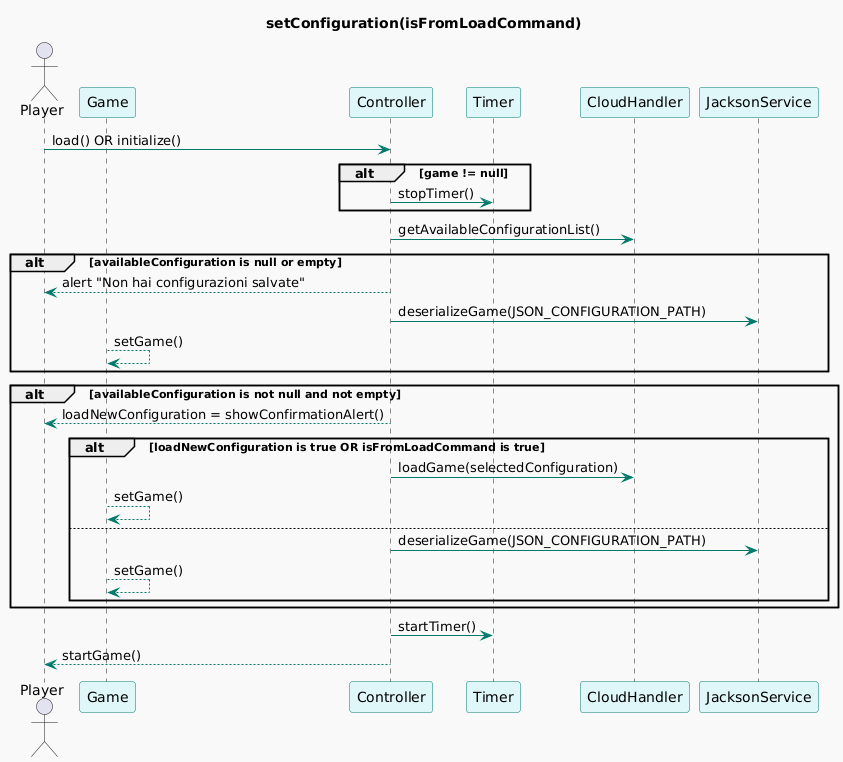
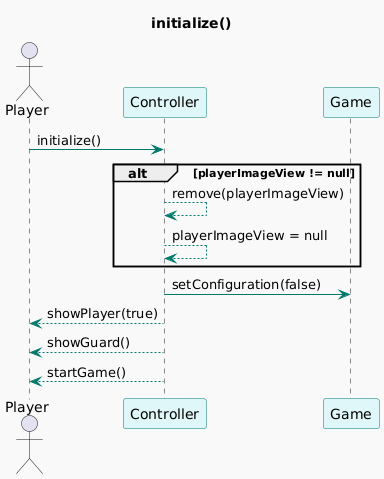

**Domain Model**

**System Sequence Diagram**

**Design Class Model**

  
**Internal Sequence Diagrams**

*move(direction)*

*timerFinished()*

*setConfiguration(isFromLoadCommand)*

*initialize()*

  
