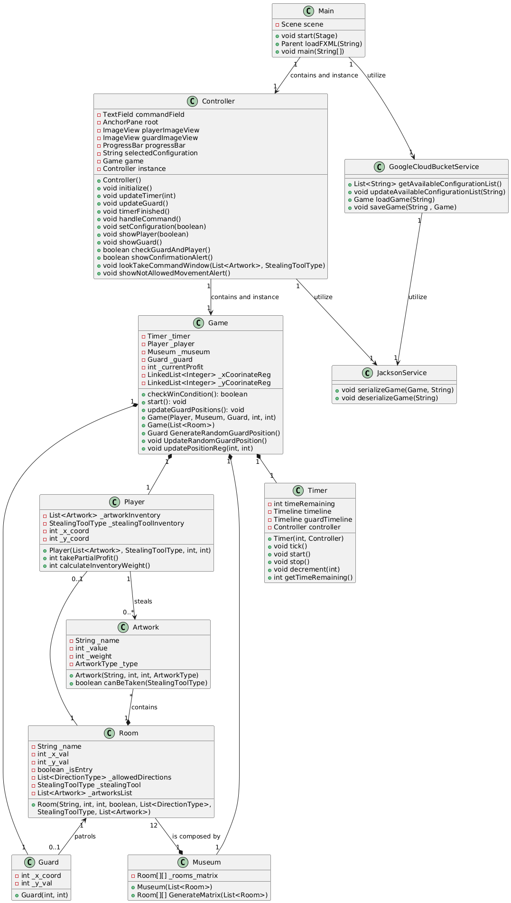

```uml


@startuml
class JacksonService{
    + void serializeGame(Game, String)
    + void deserializeGame(String)
}
class Controller{
    - TextField commandField
    - AnchorPane root
    - ImageView playerImageView
    - ImageView guardImageView
    - ProgressBar progressBar
    - String selectedConfiguration
    - Game game
    - Controller instance
    + Controller()
    + void initialize()
    + void updateTimer(int)
    + void updateGuard()
    + void timerFinished()
    + void handleCommand()
    + void setConfiguration(boolean)
    + void showPlayer(boolean)
    + void showGuard()
    + boolean checkGuardAndPlayer()
    + boolean showConfirmationAlert()
    + void lookTakeCommandWindow(List<Artwork>, StealingToolType)
    + void showNotAllowedMovementAlert()
}
class Main{
    - Scene scene
    + void start(Stage)
    + Parent loadFXML(String)
    + void main(String[])
}
class GoogleCloudBucketService{
    + List<String> getAvailableConfigurationList()
    + void updateAvailableConfigurationList(String)
    + Game loadGame(String)
    + void saveGame(String , Game)

}
class Game {
    - Timer _timer
    - Player _player
    - Museum _museum
    - Guard _guard
    - int _currentProfit
    - LinkedList<Integer> _xCoorinateReg
    - LinkedList<Integer> _yCoorinateReg
    + checkWinCondition(): boolean
    + start(): void
    + updateGuardPositions(): void
    + Game(Player, Museum, Guard, int, int)
    + Game(List<Room>)
    + Guard GenerateRandomGuardPosition()
    + void UpdateRandomGuardPosition()
    + void updatePositionReg(int, int)
}
class Player {
    - List<Artwork> _artworkInventory
    - StealingToolType _stealingToolInventory
    - int _x_coord
    - int _y_coord
    + Player(List<Artwork>, StealingToolType, int, int)
    + int takePartialProfit()
    + int calculateInventoryWeight()
}
class Room {
    - String _name
    - int _x_val
    - int _y_val
    - boolean _isEntry
    - List<DirectionType> _allowedDirections
    - StealingToolType _stealingTool
    - List<Artwork> _artworksList
    + Room(String, int, int, boolean, List<DirectionType>,
            StealingToolType, List<Artwork>)
}
class Guard{
    - int _x_coord
    - int _y_val
    + Guard(int, int)
}
class Museum{
    - Room[][] _rooms_matrix
    + Museum(List<Room>)
    + Room[][] GenerateMatrix(List<Room>)
}

class Artwork{
    - String _name
    - int _value
    - int _weight
    - ArtworkType _type
    + Artwork(String, int, int, ArtworkType)
    + boolean canBeTaken(StealingToolType)
}
class Timer{
    - int timeRemaining
    - Timeline timeline
    - Timeline guardTimeline
    - Controller controller
    + Timer(int, Controller)
    + void tick()
    + void start()
    + void stop()
    + void decrement(int)
    + int getTimeRemaining()
}

Main "1" --> "1" Controller : contains and instance
Controller "1" --> "1" JacksonService : utilize
Main "1" --> "1" GoogleCloudBucketService : utilize
GoogleCloudBucketService "1" --> "1" JacksonService : utilize
Controller "1" --> "1" Game : contains and instance
Game "1" *-- "1" Player
Game "1" *-- "1" Museum
Game "1" *-- "1" Guard
Game "1" *-- "1" Timer
Player "1" --> "0..*" Artwork : steals
Player "0..1" -- "1" Room
Artwork "*" --* "1" Room : contains
Room "1" <-- "0..1" Guard : patrols
Room "12" --* "1" Museum : is composed by


@enduml
